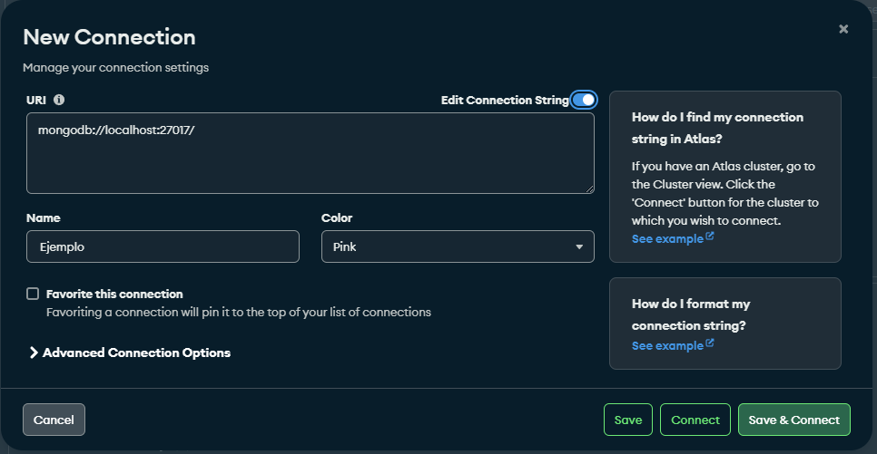

# TFG2024-AntonioPRaulS
## TFG 2024 - Aplicación Móvil

### Descripción del juego

El juego consiste en ir capturando y mejorando los critterons, unas pequeñas criaturas que alojaremos en nuestro hotel. 
Para poder obtener nuevos critterons, así como entrenarlos y ampliar nuestras instalaciones, tendremos que desplazarnos mientras luchamos contra otros critterons y visitamos lugares de interes. 
Los Critterons son criaturas únicas y el principal reclamo del juego, cada una con características propias.  Estos critterons cuentan con salud, estadísticas de ataque y defensa así como ataques especiales que se verán influenciados por el nivel que tengan. 

### Desarrollo

El juego esta desarrollado con el motor de Unity. Además para su uso también se ha desarrollado una API encargada de gestionar la base de datos. Estas usan SpringBoot para la API y MongoDB para la base de datos.

## Despligue de API y juego

#### Base de datos en MongoDB

La base de datos se que se usa en el proyecto es **MongoDB**. Por ello que si queremos tener y usar la API ya desarrollada modificando lo mínimo se recomienda su uso. A través de MongoDB podremos tener los datos tanto en un entorno local o en línea. A continuación se hara una guía con los pasos que hay que seguir para configuración de esta base de datos. La guía se hará para tener los datos en local, pero se irán comentando las diferencias que tendremos que realizar si queremos que los datos estén linea.

Para mayor facilidad se recomienda la instalación de **MongoDB Compass**, que nos permite ver de una manera muy sencilla las conexiones que tenemos.

Primero tendremos que crear una nueva conexión y configurarla:
Si nos encontramos en MongoDB Compass tendremos que darle al boton que nos permite crear una nueva conexión:

Y tras esto nos saldrá la siguiente pantalla:

En la URI deberemos poner o localhost con el puerto que se nos indica si vamos a querer los datos en local o la URI que nos proporciona MongoDB si queremos una base de datos en linea. En el segundo caso deberemos crearla desde la web de MongoDB. Al crear el cluster desde la web nos da la opción de poder vincularlo con MongoDB Compass, proporcionandonos la informacion que deberemos poner en la URI.

Una vez configurada deberemos dar a "Save & Connect".

Tras esto, podemos crear dentro de esa conexión la base de datos llamada "Game". Esta contendrá los siguientes directorios:

      - Critteron
      - GameInfo
      - Room
      - User
      - UserInfo
      - Mark

En caso de no crearlas manualmente estas se crearán de manera automatica al insertar un dato.

#### Conexión cliente - API
Las conexiones del juego con el servidor se gestionan mediante una **API**. La ruta para acceder a esta API es **modificable**, y para ello, solo necesitas acceder al archivo `server_config.json` dentro de la carpeta `./Assets/Resources`del proyecto de Unity.

**Parámetros a configurar en el archivo `server_config.json`**:

- **`baseURL`**:  
  Puede ser tanto `"http://localhost"` como una URL de internet. Define la dirección base del servidor.

- **`port`** *(opcional)*:  
  Parámetro opcional. En caso de que la dirección se encuentre en un puerto personalizado dentro de la URL.

- **`apiVersion`**:  
  Define la versión de la API que se está utilizando, lo que permite cambiar fácilmente entre diferentes versiones de la misma.

#### Conexión API - Base de Datos
La base de datos a la que ataca la API pueden ser definidas dinámicamente. Para esto tenemos dos opciones, todos los archivos que se nombran aquí se encuentran en `DataBase\apiDinamica`.

**Definición manual**:

1. Abrimos una consola como administrador, recomendamos situarnos en el directorio `DataBase\apiDinamica`.
2. Creamos variables de entorno.
     - Si es una base de datos en línea: definimos _MONGODB_URI_ y le asignamos la url de la base de datos.
     - Si es una base de datos en local: definimos _MONGO_HOST_ y _MONGO_PORT_ y le asignamos el host y el puerto correspondientes.
3. Lanzamos el (nombre-jar-línea).jar o (nombre-jar-local).jar según si lo hemos configurado para línea o local respectivamente.

Para generar un .jar usamos **Maven**, a través del siguiente comando por PowerShell: mvn clean package.

Y para ejecutar el .jar usamos:  java -jar nombre.jar 

**Definición guiada**:

1. Ejecutamos `launcher.bat` desde una consola como administrador ubicada en `DataBase\apiDinamica`.
2. Seleccionamos la opción correspondiente, según queramos remoto o local.
3. Introducimos las valores de cada variable según las solicite, esto creará las variables de entorno.
4. Automáticamente, `launcher.bat`lanzará el .jar correspondiente a la modalidad que hayamos seleccionado.

#### Con estos dos pasos se puede configurar de manera sencilla el flujo de datos.

#### Datos estáticos del juego

Existen datos que el juego debe de tener en un inicio para poder jugarse (los critterons, las habitaciones y las marks). Por ello, para facilitar la subida de estos datos, está el proyecto "DataUploader". Lo que tendremos que hacer en este es ejecutar el .jar dependiendo de lo que queramos conseguir. Tendremos que pasarle dos parametros:
  
  - El primero tomará los valores de critteron/rooms/marks. De esta manera subiremos los datos del tipo seleccionado.
  - El segundo parametro será el inicio de la llamada http. Es decir definir donde esta alojada la API.

Un ejemplo podría ser:

 java -jar target/dataupload-1.0-SNAPSHOT.jar rooms http://localhost:8080

